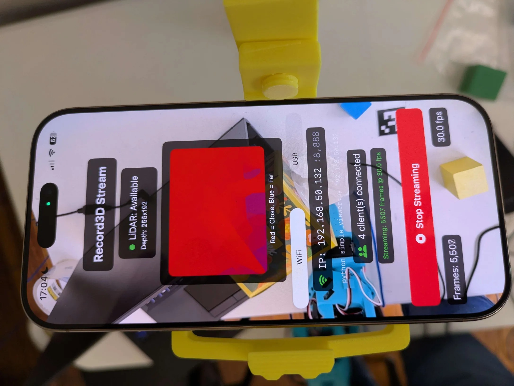
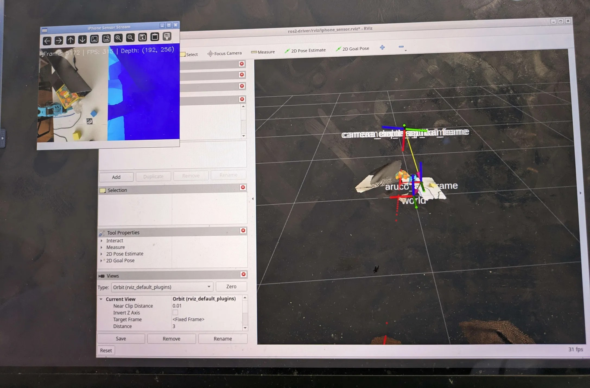

# iPhone Sensor Suite

[](https://discord.gg/xukJ3nh9wC)
[](https://github.com/PathOn-AI?tab=followers)
[](https://github.com/PathOn-AI/pathon_opensource/stargazers)

Use an iPhone as a full sensor suite (LiDAR RGBD, IMU, confidence) for low-cost robot manipulation and autonomous navigation. Stream to Python or ROS2 over WiFi or USB.

📖 [Blog: iPhone as a Robot Sensor Suite](https://www.pathon.ai/blog/iphone-as-sensor) *(work in progress)*

<p align="center">
  
  
</p>

## iOS App

Download the free iOS streaming app:

[](https://apps.apple.com/app/id6761314229)

## Overview

The iPhone LiDAR (dToF flash sensor) + RGB camera + IMU replaces multiple traditional robot sensors:

| iPhone Sensor | Replaces | Output |
|---|---|---|
| LiDAR + RGB + ML | Depth camera (RealSense) | PointCloud2, depth image |
| LiDAR (middle row) | 2D LiDAR (RPLIDAR, Hokuyo) | LaserScan |
| RGB camera | USB camera | Color image |
| IMU (accelerometer + gyroscope) | External IMU | IMU data |

## Architecture

```
iPhone (iOS App)                          PC / Robot (ROS2)
┌────────────────────┐                   ┌──────────────────────────┐
│ ARKit captures:    │   WiFi / USB      │ Python SDK               │
│  - RGB image       │ ──────────────→   │  - Decode stream         │
│  - LiDAR depth     │   TCP stream      │                          │
│  - IMU data        │                   │ ROS2 Driver              │
│  - Camera params   │                   │  - PointCloud2           │
│  - Camera pose     │                   │  - LaserScan             │
│  - Confidence map  │                   │  - RGB + Depth images    │
└────────────────────┘                   │  - CameraInfo            │
                                         │  - IMU                   │
                                         │  - TF tree               │
                                         │                          │
                                         │ Calibration              │
                                         │  - ArUco marker pose     │
                                         │  - base → camera_link TF │
                                         └──────────────────────────┘
```

## Project Structure

```
├── sdk/                    # Python client library
├── ros2-driver/            # ROS2 Jazzy package
├── calibration/            # ArUco-based camera-to-robot calibration
└── images/                 # Demo images
```

## Prerequisites

- **iPhone**: iPhone 12 Pro or newer (with LiDAR) running the iOS streaming app
- **Host machine**: Ubuntu with ROS2 Jazzy (for ROS2 usage) or any OS with Python 3.10+ (for Python-only usage)
- **Network**: iPhone and host machine on the same WiFi network (for WiFi mode)
- **USB mode** (optional): `sudo apt install libimobiledevice-utils libusbmuxd-tools` (Linux) or `brew install libimobiledevice` (macOS)

## Quick Start

### 1. iPhone App

1. Install and launch the iOS streaming app on your iPhone Pro
2. The app displays the **server IP address** on screen — you'll need this for the next steps

### 2. Python Client (no ROS2 required)

```bash
cd sdk
python3 -m venv venv
source venv/bin/activate
pip install -e ".[visualization]"

# View RGB + depth side-by-side
python examples/simple_viewer.py <IPHONE_IP>

# Test protocol v2 data (confidence, IMU)
python examples/test_v2.py <IPHONE_IP>
```

### 3. ROS2 Package

#### Build

```bash
# 1. Create virtual environment (--system-site-packages inherits ROS2 Python packages like cv_bridge, rclpy)
cd ros2-driver
python3 -m venv --system-site-packages venv
source venv/bin/activate

# 2. Install Python dependencies
#    numpy<2 is required for compatibility with ROS2 Jazzy's cv_bridge
pip install "numpy<2" -e ../sdk -e .

# 3. Build with colcon
source /opt/ros/jazzy/setup.bash
cd ..  # project root (parent of ros2-driver/)
colcon build --packages-select ros2_driver --symlink-install
```

#### Run

You need two terminals — one for the ROS2 node and one for RViz2.

**Terminal 1: Start the ROS2 node**

```bash
export ROS_DOMAIN_ID=50
source /opt/ros/jazzy/setup.bash
source ros2-driver/venv/bin/activate
# WiFi mode: replace with your iPhone's IP from the iOS app
python3 -m ros2_driver.iphone_sensor_node --ros-args -p host:=<IPHONE_IP>

# USB mode: connect iPhone via USB cable (no WiFi needed)
python3 -m ros2_driver.iphone_sensor_node --ros-args -p usb:=true
```

You should see output like:
```
[INFO] Connecting to <IPHONE_IP>:8888...
[INFO] Connected! Starting frame loop.
[INFO] First frame: depth=(192, 256), color=(1440, 1920, 3), conf=yes, imu=yes
[INFO] Published 30 frames
```

**Terminal 2: Visualize in RViz2**

```bash
export ROS_DOMAIN_ID=50
source /opt/ros/jazzy/setup.bash
rviz2 -d ros2-driver/rviz/iphone_sensor.rviz
```

A pre-configured RViz layout is included that displays the RGB image, point cloud, laser scan, TF tree, and more.

**Terminal 2 (alternative): Verify topics**

```bash
export ROS_DOMAIN_ID=50
source /opt/ros/jazzy/setup.bash
ros2 topic list
ros2 topic hz /color/image_raw
```

### 4. Calibrate with ArUco Marker

Print ArUco marker (DICT_6X6_250, ID 3, 3.8cm) and place it with axes aligned to robot base frame.

```bash
python3 -m calibration.camera_calibration
```

See [calibration/README.md](calibration/README.md) for detailed instructions.

## ROS2 Topics

| Topic | Type | Rate | Description |
|-------|------|------|-------------|
| `color/image_raw` | `sensor_msgs/Image` | 30fps | RGB image (bgr8, 1920x1440) |
| `color/camera_info` | `sensor_msgs/CameraInfo` | 30fps | RGB intrinsics |
| `depth/image_rect_raw` | `sensor_msgs/Image` | 30fps | Depth (32FC1 meters, 256x192) |
| `depth/camera_info` | `sensor_msgs/CameraInfo` | 30fps | Depth intrinsics (scaled from RGB) |
| `aligned_depth_to_color/image_raw` | `sensor_msgs/Image` | ~6fps | Depth upscaled to RGB resolution |
| `aligned_depth_to_color/camera_info` | `sensor_msgs/CameraInfo` | ~6fps | Same as RGB intrinsics |
| `depth/color/points` | `sensor_msgs/PointCloud2` | ~6fps | Colored point cloud |
| `confidence/image_raw` | `sensor_msgs/Image` | 30fps | Confidence map (mono8, 0/1/2) |
| `imu` | `sensor_msgs/Imu` | 30fps | Accelerometer + gyroscope |
| `scan` | `sensor_msgs/LaserScan` | 30fps | 2D laser scan from middle row of depth |

QoS: All topics use **BEST_EFFORT** reliability, **VOLATILE** durability, **KEEP_LAST(1)**. In RViz2, set the display's Reliability Policy to **"Best Effort"** or you won't see data.

TF tree: `world` -> `camera_link` -> `camera_color_optical_frame` / `camera_depth_optical_frame`

## ROS2 Parameters

| Parameter | Default | Description |
|-----------|---------|-------------|
| `host` | `192.168.1.100` | iPhone IP address (WiFi mode) |
| `port` | `8888` | TCP port |
| `usb` | `false` | Use USB mode via iproxy (ignores host) |
| `camera_name` | `camera` | Topic/TF prefix |
| `publish_pointcloud` | `true` | Enable PointCloud2 |
| `publish_aligned_depth` | `true` | Enable aligned depth to color |
| `publish_confidence` | `true` | Enable confidence map |
| `publish_imu` | `true` | Enable IMU topic |
| `publish_scan` | `true` | Enable LaserScan topic |
| `depth_range_min` | `0.1` | Min depth in meters |
| `depth_range_max` | `5.0` | Max depth in meters |
| `min_confidence` | `1` | Min ARKit confidence for point cloud (0=low, 1=medium, 2=high) |

## 📰 News

| Date | Release |
|------|---------|
| 2026-04-17 | New version of calibration (coming soon) |
| 2026-04-07 | iOS app released on the [App Store](https://apps.apple.com/app/id6761314229) |
| 2026-03-09 | iPhone Sensor Suite open-sourced: Python SDK, ROS2 driver, and ArUco calibration |

## How iPhone LiDAR Works

The iPhone LiDAR is a 3D dToF (direct Time-of-Flight) flash sensor. ARKit processes the raw data through three internal pipelines:

| Pipeline | Input | Output | Persistence | We Use It |
|---|---|---|---|---|
| **Depth** | LiDAR + RGB + ML | `sceneDepth` (256x192 depth image) | Per-frame | Yes |
| **Scene Mesh** | Many LiDAR frames accumulated | `ARMeshAnchor` (triangle mesh + classification) | Persistent | Not yet |
| **Body Tracking** | RGB + Neural Engine ML | `ARBodyAnchor` (91 skeleton joints) | Per-frame | Not yet |

Currently we only use Pipeline 1 (depth). The depth image is unprojected to a point cloud (all pixels) and sliced into a LaserScan (middle row).

