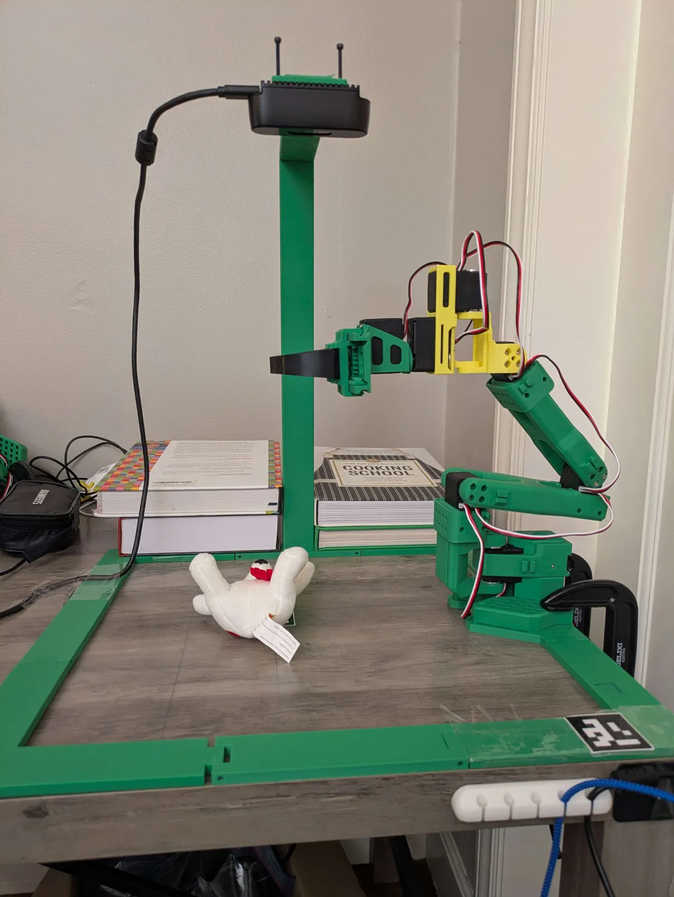
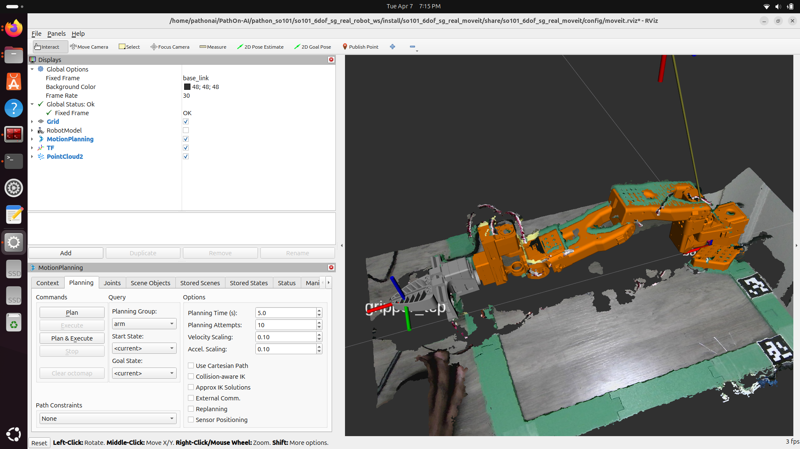

# SO-101 6DoF + Symmetric Gripper

An upgrade kit for the [SO-101](https://github.com/TheRobotStudio/SO-ARM100) robotic arm, adding a 6th degree of freedom (wrist pitch + yaw) and a symmetric parallel-jaw gripper. The 6DoF wrist enables the arm to approach objects from any angle, and the symmetric gripper provides balanced grasping force -- together enabling seamless integration with state-of-the-art grasp generation models and making it easier to grasp objects reliably.

*Fully assembled SO-101 6DoF arm with symmetric gripper on a playground setup with overhead camera mount.*

*RViz visualization showing MoveIt motion planning, robot model, TF frames, and point cloud overlay.*

## What's Included

### 6DoF Wrist Upgrade
The standard SO-101 is a 5DoF arm. This upgrade replaces the wrist with two new 3D-printed links (pitch and yaw), adding a 6th degree of freedom for greater dexterity.

- `link_pitch` -- wrist pitch joint
- `link_yaw` -- wrist yaw joint

### Symmetric Gripper
A rack-and-pinion parallel-jaw gripper where both fingers move equally, providing balanced gripping force. Designed for reliable pick-and-place and manipulation tasks.

- `frame` -- gripper body
- `cam` -- cam mechanism
- `rack_up` / `rack_down` -- rack pair for symmetric motion
- `l_gripper` / `r_gripper` -- left and right finger

## Prerequisites

You need a built [SO-101 arm](https://github.com/TheRobotStudio/SO-ARM100) as the base. This kit provides the additional parts for the 6DoF upgrade and symmetric gripper.

## Demos

### Vision-Language Grasping (Simulation)

We implement a vision-language grasping pipeline using SAM3 for segmentation and grasp generation models. Given a natural language command (e.g., "pick up the banana"), the system segments the target object and plans a grasp.

https://github.com/user-attachments/assets/banana_pick_demo.mp4

*Simulated pick-and-place with vision-language grasping.*

### Vision-Language Grasping (Real Robot)

Real-robot vision-language grasping is under active development -- demo coming soon. The real robot is already integrated with ROS2 MoveIt for motion planning, with point cloud overlay for scene understanding.

https://github.com/user-attachments/assets/moveit_demo.mp4

*MoveIt motion planning with point cloud overlay on the physical SO-101 6DoF arm.*

## Getting Started

1. Print the 3D parts -- see [hardware/](hardware/) for files and assembly instructions
2. Assemble the wrist upgrade and gripper onto your SO-101
3. Software integration -- coming soon

## 📰 News

| Date | Release |
|------|---------|
| -- | Real-robot vision-language grasping demo (coming soon) |
| -- | Software release: URDF, MJCF, digital twin, ROS2, MoveIt config, MuJoCo simulation (coming soon) |
| 2026-04-07 | Demo videos: vision-language grasping (simulation), MoveIt motion planning with point cloud (real robot) |
| 2026-04-07 | Hardware release: 6DoF wrist (pitch + yaw) STL/STEP files, symmetric gripper STL/STEP files |

## License

See the root [LICENSE](../LICENSE) for details.
