# Hardware -- Assembly Guide

## Bill of Materials

### 6DoF Wrist Upgrade BOM

| # | Part | Qty | Source |
|---|------|-----|--------|
| 1 | STS3215 servo | 1 | Purchased |
| 2 | link_pitch | 1 | 3D printed |
| 3 | link_yaw | 1 | 3D printed |

### Symmetric Gripper BOM

| # | Part | Qty | Source |
|---|------|-----|--------|
| 1 | STS3215 servo | 1 | Purchased |
| 2 | frame | 1 | 3D printed |
| 3 | cam | 1 | 3D printed |
| 4 | rack_up | 1 | 3D printed |
| 5 | rack_down | 1 | 3D printed |
| 6 | l_gripper | 1 | 3D printed |
| 7 | r_gripper | 1 | 3D printed |

## 3D Printed Parts

All parts can be printed with standard PLA/PETG filament. STL files are for slicing, STEP files are provided for modification.

### Print Orientation

Orient the parts as shown below for optimal layer strength. Parts are positioned so that load-bearing surfaces have layers running perpendicular to the primary stress direction.

**6DoF Wrist Parts**

  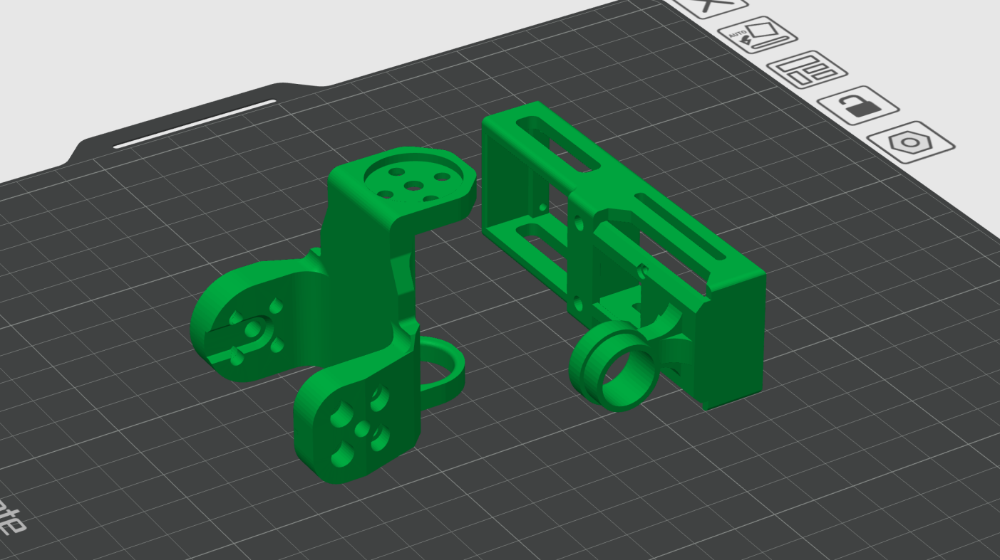

**Symmetric Gripper Parts**

  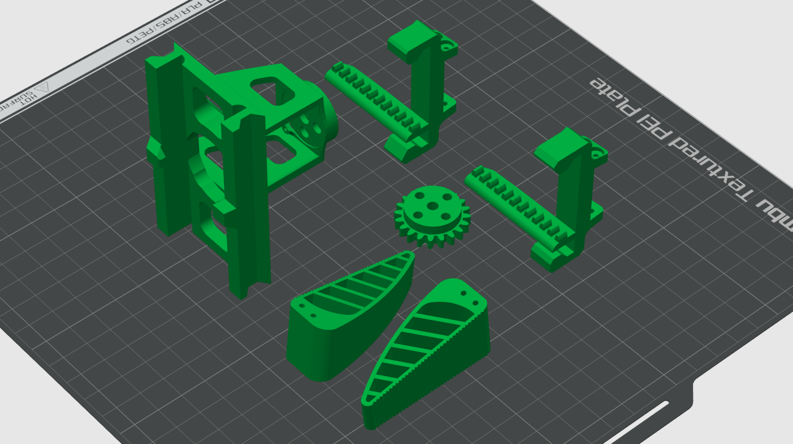

### 6DoF Wrist Upgrade

| Part | STL | STEP |
|------|-----|------|
| Wrist Pitch Link | [link_pitch.stl](3d_printed_parts/6dof/stl/link_pitch.stl) | [link_pitch.step](3d_printed_parts/6dof/step/link_pitch.step) |
| Wrist Yaw Link | [link_yaw.stl](3d_printed_parts/6dof/stl/link_yaw.stl) | [link_yaw.step](3d_printed_parts/6dof/step/link_yaw.step) |

### Symmetric Gripper

| Part | STL | STEP |
|------|-----|------|
| Frame | [frame.stl](3d_printed_parts/symmetric_gripper/stl/frame.stl) | -- |
| Cam | [cam.stl](3d_printed_parts/symmetric_gripper/stl/cam.stl) | -- |
| Rack (upper) | [rack_up.stl](3d_printed_parts/symmetric_gripper/stl/rack_up.stl) | -- |
| Rack (lower) | [rack_down.stl](3d_printed_parts/symmetric_gripper/stl/rack_down.stl) | -- |
| Left Finger | [l_gripper.stl](3d_printed_parts/symmetric_gripper/stl/l_gripper.stl) | -- |
| Right Finger | [r_gripper.stl](3d_printed_parts/symmetric_gripper/stl/r_gripper.stl) | -- |
| Full Assembly | -- | [Parallel_gripper_assembly.step](3d_printed_parts/symmetric_gripper/step/Parallel_gripper_assembly.step) |

## Assembly

### Step 1 -- Attach the Pitch Link to the SO-101 Arm

Mount the `link_pitch` onto the last servo of the SO-101 arm using the servo horn.

  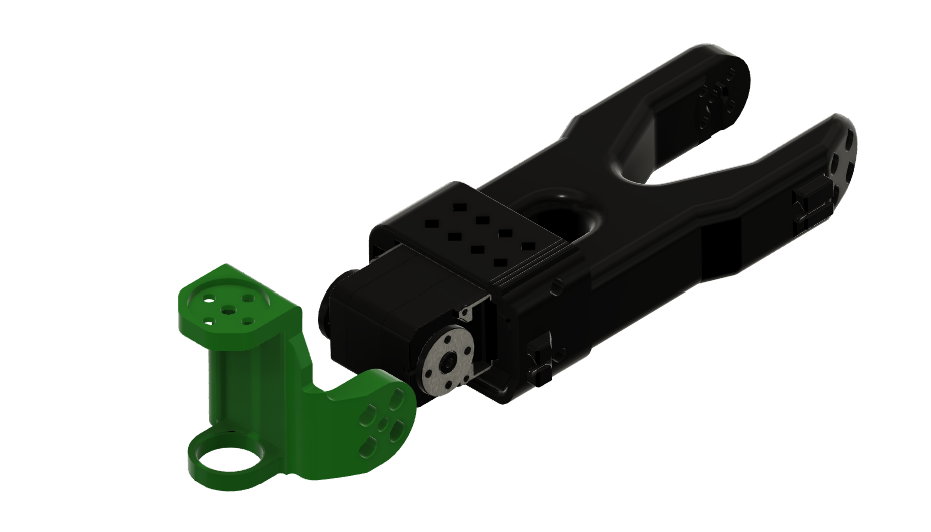

Secure the pitch link using the servo screws so it rotates freely on the pitch axis.

  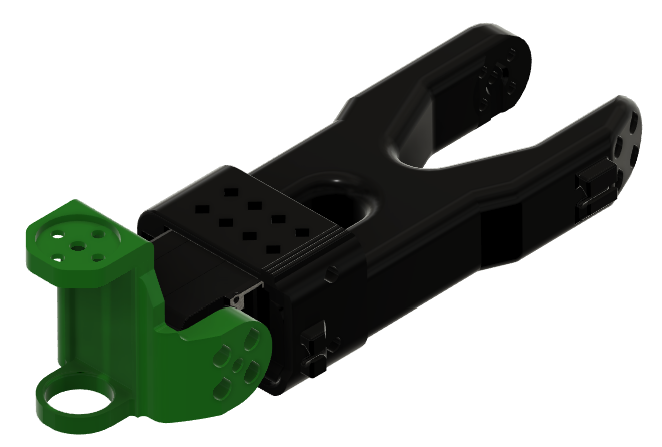

### Step 2 -- Install the Yaw Servo

Insert an STS3215 servo into the `link_yaw` mount. The servo should sit flush inside the yaw link.

  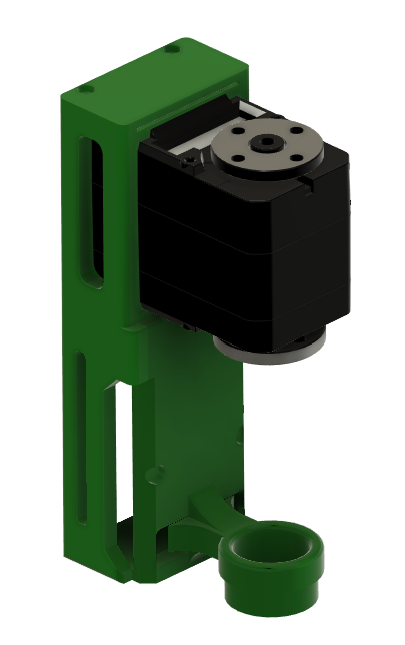

Secure the STS3215 servo by 2 self tapping screws from the servo pack

  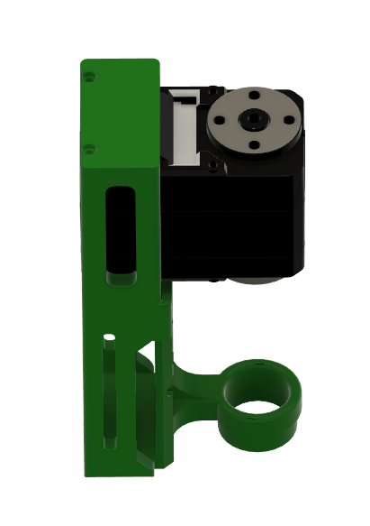

### Step 3 -- Attach the Roll Servo

Connect the `link_yaw` assembly with the bottom servo.

  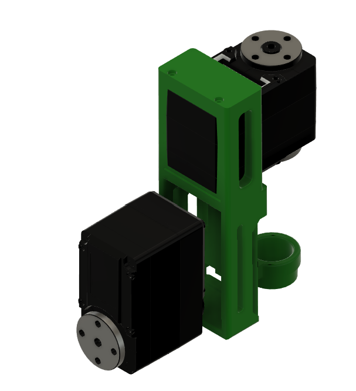

Secure the bottom servo with the 4 self tapping screws.

  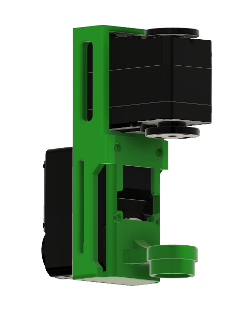

### Step 4 -- Fix yaw to pitch

The completed wrist assembly with both pitch and yaw links attached to the SO-101 arm.

  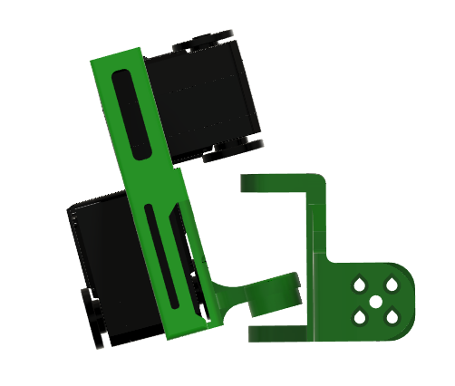

Attach the Yaw servo horn to the top face of the pitch link and secure it with screws

  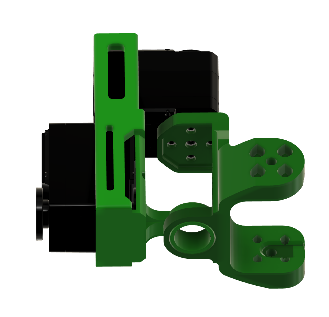

### Step 5 -- Prepare the Gripper Frame

Take the gripper `frame` and position it for mounting onto the yaw link.

  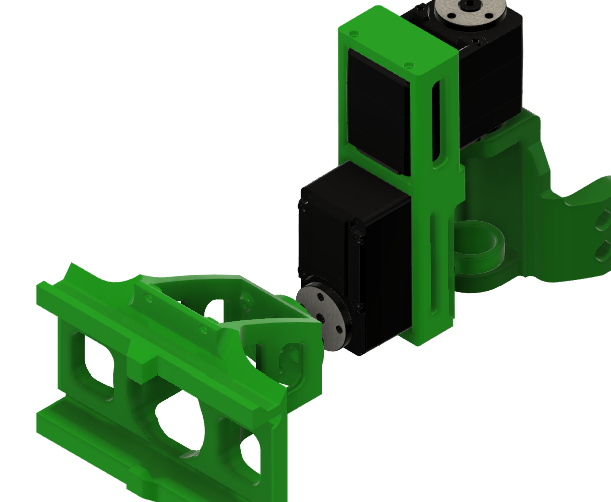

Place the Frame link onto the bottom servo of the Yaw link servo and secure it with the servo screws.

  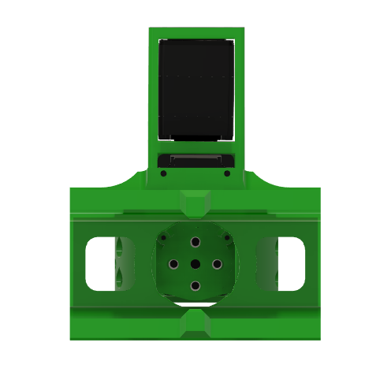

### Step 6 -- Mount the Gripper Servo

***Connect the Servo wire to the STS3215 servo*** and then Insert it into the gripper `frame`. The servo sits in the top cavity of the frame.

  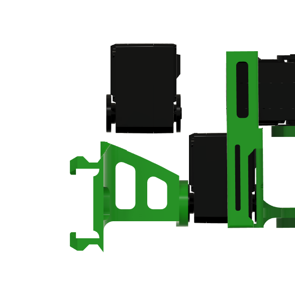

Secure it with two self tapping screws on the top

  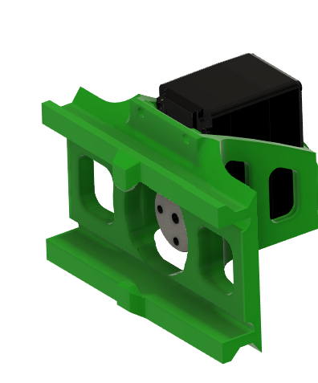

Secure it with two self tapping screws on the back side above the servo flange cavity

  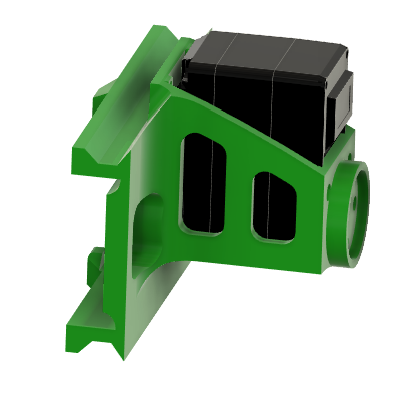

### Step 7 -- Install the Cam and Racks

Attach the `cam` gear to the servo output shaft inside the frame. and secure it with screws

  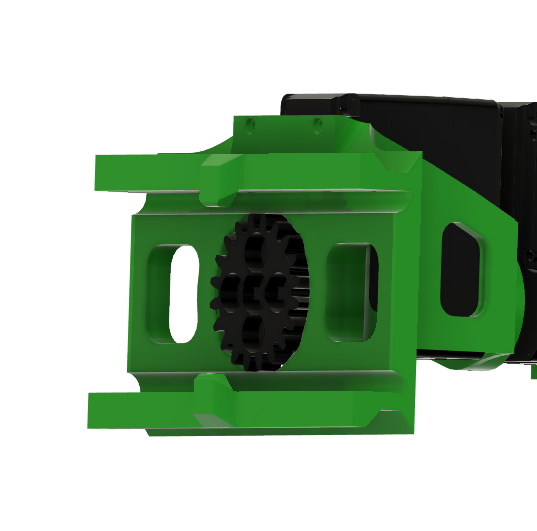

Then slide `rack_up` and `rack_down` into the frame channels so the cam teeth mesh with both racks.

  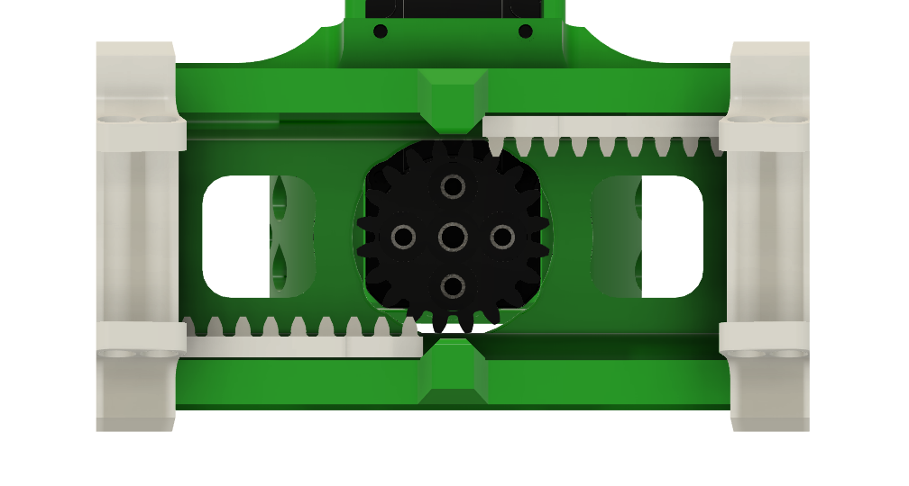

### Step 8 -- Attach the Gripper Fingers

Attach `l_gripper` and `r_gripper` to the ends of the upper and lower racks respectively.

  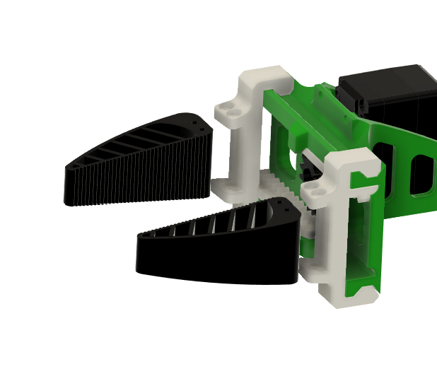

### Step 9 -- Completed Assembly

The fully assembled SO-101 6DoF arm with symmetric gripper.

  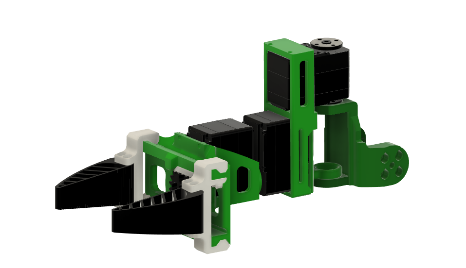

